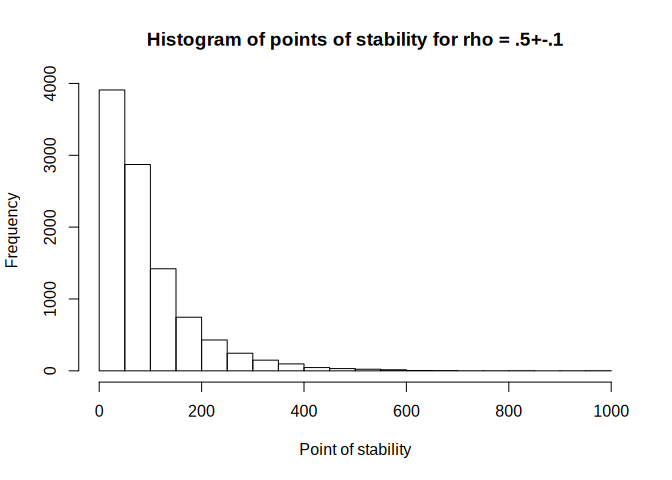

<!-- README.md is generated from README.Rmd. Please edit that file -->

# fastpos

<!-- badges: start -->

[](https://travis-ci.org/johannes-titz/fastpos)
[](https://codecov.io/gh/johannes-titz/fastpos?branch=master)
[](https://CRAN.R-project.org/package=fastpos)
<!-- badges: end -->

The R package *fastpos* provides a fast algorithm to calculate the
required sample size for a Pearson correlation to stabilize in a
sequential framework \[@schonbrodt2013;@schonbrodt2018\]. Basically, one
wants to find the sample size at which one can be sure that 1-α percent
of many studies would fall into a specified corridor of stability around
an assumed population correlation and stay inside the corridor if more
more participants are added to the study. For instance, *how many*
participants per study are required so that out of 100k studies, 90%
would fall into the region between .4 to .6 (a Pearson correlation) and
not leave this region anymore when more participants are added (under
the assumption that the population correlation is .5). This sample size
is also referred to as the *critical point of stability* for the
specific parameters.

The approach is related to accuracy in parameter estimation \[AIPE, e.g.
@maxwell2008\] and as such can be seen as an alternative to power
analysis. In contrast to AIPE, the concept of *stability* incorporates
the idea of sequentially adding participants to a study. Although the
approach is young, it already attracted a lot of interest in the
psychological research community, which is evident in over 600 citations
of the original publication \[@schonbrodt2013\]. To date there exists no
easy way to use sequential stability for individual sample size planning
because there is no analytical solution to the problem and a simulation
approach is comptutationally expensive. The package *fastpos* resolves
this issue by speeding up the calculation of correlations. The algorithm
runs more than 100 times faster than the original implementation, paving
the way for a wider usage of the *stability* approach. The algorithm
runs more than 100 times faster than the original implementation, paving
the way for a wider usage of the *stability* approach.

## Installation

You can install the released version of fastpos from
[CRAN](https://CRAN.R-project.org) with:

``` r
install.packages("fastpos")
```

You can install the development version from
[GitHub](https://github.com/) with devtools (and vignettes build, this
takes a couple of seconds):

``` r
devtools::install_github("johannes-titz/fastpos", build_vignettes = TRUE)
```

## Using *fastpos*

If you have found this page, I assume you either want (1) to calculate
the critical point of stability for your own study or (2) to explore the
method in general. If this is the case, read on and hopefully you will
find what you are looking for. Let us first load the package and set a
seed for reproducibility:

``` r
library(fastpos)
set.seed(19950521)
```

In most cases you will just need the function **find\_critical\_pos**
which will you give you the critical point of stability for your
specific parameters.

Let us reproduce Schönbrodt and Peruigini’s quite famous, often cited
table of the critical points of stability for a precision of 0.1. We
reduce the number of studies to 10k so that it runs fairly quickly.

``` r
find_critical_pos(rho = seq(.1, .7, .1), sample_size_max = 1000,
                  n_studies = 10000)
#> Warning in find_critical_pos(rho = seq(0.1, 0.7, 0.1), sample_size_max = 1000, : 32 simulation[s] did not reach the corridor of
#>             stability.
#> Increase sample_size_max and rerun the simulation.
#>      rho_pop 80% 90%    95% sample_size_min sample_size_max lower_limit upper_limit n_studies n_not_breached precision
#> 1 0.09908227 253 359 476.00              20            1000         0.0         0.2     10000             11       0.1
#> 2 0.19993267 234 338 457.00              20            1000         0.1         0.3     10000             14       0.1
#> 3 0.29982634 212 300 396.05              20            1000         0.2         0.4     10000              5       0.1
#> 4 0.39933030 182 262 342.00              20            1000         0.3         0.5     10000              2       0.1
#> 5 0.50035764 139 204 270.00              20            1000         0.4         0.6     10000              0       0.1
#> 6 0.59961802 104 151 201.00              20            1000         0.5         0.7     10000              0       0.1
#> 7 0.69905041  65  96 128.05              20            1000         0.6         0.8     10000              0       0.1
#>   precision_rel
#> 1         FALSE
#> 2         FALSE
#> 3         FALSE
#> 4         FALSE
#> 5         FALSE
#> 6         FALSE
#> 7         FALSE
```

The results are very close to Schönbrodt and Perugini’s table (see
<https://github.com/nicebread/corEvol>). Note that a warning is shown
because in some simulations the corridor of stability was not reached.
As long as this number is low, this should not affect the estimates
much. But if you want to get more accurate estimates increase the
maximum sample size.

If you want to dig deeper, you can have a look at the functions that
*find\_critical\_pos* builds upon. **simulate\_pos** is the workhorse of
the package. It calls a C++ function to calculate correlations
sequentially and it does this pretty fast (but you know that already,
right?). A rawish approach would be to create a population with
**create\_pop** and pass it to **simulate\_pos**:

``` r
pop <- create_pop(0.5, 1000000)
pos <- simulate_pos(x_pop = pop[,1],
                    y_pop = pop[,2],
                    number_of_studies = 10000,
                    sample_size_min = 20,
                    sample_size_max = 1000,
                    replace = T,
                    lower_limit = 0.4,
                    upper_limit = 0.6)
hist(pos, xlim = c(0, 1000), xlab = c("Point of stability"),
     main = "Histogram of points of stability for rho = .5+-.1")
```

<!-- -->

``` r
quantile(pos, c(.8, .9, .95), na.rm = T)
#> 80% 90% 95% 
#> 142 205 274
```

Note that no warning message appears if the corridor is not reached. It
will simply return the maximum sample size. So pay careful attention if
you work with this function and adjust the maximum sample size as
needed.

**create\_pop** creates the population matrix by using **mvrnorm**. This
is a much simpler way compared to Schönbrodt and Perugini’s approach,
but the results do not seem to differ. If you are interested in how
population parameters (e.g. skewness) affect the point of stability, you
should rather refer to the population generating functions in Schönbrodt
and Perugini’s work.

## How fast is *fastpos*?

In the introduction I boldly claimed that fastpos is much faster than
the original implementation of Schönbrodt and Perugini (corEvol). The
difference is so big that it should suffice to give a rough benchmark
with the following parameters: rho = .1, sample\_size\_max = 1000,
sample\_size\_min = 20, n\_studies = 10000.

Note that corEvol was written for a simulation study and thus cannot be
simply called via a function. Furthermore, a simulation run takes a lot
of time and thus it is not viable to run it too many times. If you want
to experiment with the benchmark, I have forked the original corEvol
repository and made a benchmark branch (note that this will only work on
GNU/Linux, since here I am using git through the bash):

``` bash
git -C corEvol pull || git clone --single-branch --branch benchmark https://github.com/johannes-titz/corEvol
#> Already up to date.
```

For corEvol two files are sourced for the benchmark. The first is
generating the simulations and the second is calculating the critical
point of stability. I turned off all messages produced by these source
files, except for the report of the critical point of stability – to
show that is produces the same result as fastpos.

For the chosen parameters, fastpos is about 500 times faster than
corEvol, for which there are two main reasons: (1) fastpos is build
around a C++ function via Rcpp and (2) this function does not calculate
every calculation from scratch, but only calculates the difference
between the correlation at time t and t+1 via the sum formula of the
Pearson correlation. There are some other factors that might play a
role, but they cannot account for the large difference found. For
instance, setting up a population takes quite long in corEvol (about
20s), but compared to the 8min overall, this is only a small fraction.
There are other parts of the code that are destined to be slow, but
again, a speedup by a factor of 500 cannot be achieved with small
improvements. The presented benchmark is definitely not comprehensive,
but only demonstrates that fastpos can be used with no significant
waiting time for a typical scenario while for corEvol this is not the
case.

One might argue that corEvol can work with more than one core out of the
box. But it is quite easy to also parallelize fastpos, for instance with
mclapply from the parallel package. Furthermore, even a parallelized
version of corEvol would need more than 500 cores to compete with
fastpos. Overall, the speedup will hopefully pave the way for a wider
usage of the *stability* approach as a way of sample size planning.

## Issues and Support

If you find any bugs, please use the issue tracker at:

<https://github.com/johannes-titz/fastpos/issues>

If you need assistance in how to use the package, drop me an e-mail at
johannes at titz.science or johannes.titz at gmail.com

## Contributing

Contributions of any kind are very welcome\! I will sincerely consider
every suggestion on how to improve the code, the documentation and the
presented examples. Even minor things, such as suggestions for better
wording or improving grammar in any part of the package are considered
as valuable contributions.

If you want to make a pull request, please check that you can still
build the package without any errors, warnings or notes. Overall, simply
stick to the R packages book: <https://r-pkgs.org/> and follow the code
style described here: <http://r-pkgs.had.co.nz/r.html#style>

## References
