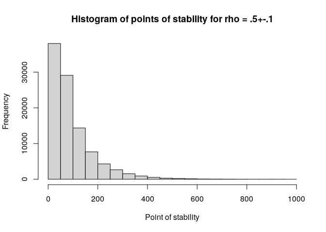

-   [fastpos](#fastpos)
    -   [Installation](#installation)
    -   [Using *fastpos*](#using-fastpos)
    -   [Parallelization](#parallelization)
    -   [How fast is *fastpos*?](#how-fast-is-fastpos)
    -   [FAQ](#faq)
        -   [What does *fastpos* do if the corridor of stability is not
            reached for a simulation
            study?](#what-does-fastpos-do-if-the-corridor-of-stability-is-not-reached-for-a-simulation-study)
        -   [Why does *fastpos* produce different estimates to
            *corEvol*?](#why-does-fastpos-produce-different-estimates-to-corevol)
    -   [Issues and Support](#issues-and-support)
    -   [Contributing](#contributing)
    -   [References](#references)

<!-- README.md is generated from README.Rmd. Please edit that file -->

# fastpos

<!-- badges: start -->

[](https://app.codecov.io/gh/johannes-titz/fastpos?branch=master)
[](https://CRAN.R-project.org/package=fastpos)
[](https://github.com/johannes-titz/fastpos/actions/workflows/R-CMD-check.yaml)
<!-- badges: end -->

The R package *fastpos* provides a fast algorithm to calculate the
required sample size for a Pearson correlation to stabilize within a
sequential framework (Schönbrodt & Perugini, 2013, 2018). Basically, one
wants to find the sample size at which one can be sure that

percent of many studies will fall into a specified corridor of stability
around an assumed population correlation and stay inside that corridor
if more participants are added to the study. For instance, find out *how
many* participants per study are required so that, out of 100k studies,
90% would fall into the region between .4 to .6 (a Pearson correlation)
and not leave this region again when more participants are added (under
the assumption that the population correlation is .5). This sample size
is also referred to as the *critical point of stability* for the
specific parameters.

This approach is related to the AO-method of sample size planning (e.g.
Algina & Olejnik, 2003) and as such can be seen as an alternative to
power analysis. Unlike AO, the concept of *stability* incorporates the
idea of sequentially adding participants to a study. Although the
approach is young, it has already attracted a lot of interest in the
psychological research community, which is evident in over 800 citations
of the original publication (Schönbrodt & Perugini, 2013). Still, to
date, there exists no easy way to use the stability approach for
individual sample size planning because there is no analytical solution
to the problem and a simulation approach is computationally expensive
with
").
The presented package overcomes this limitation by speeding up the
calculation of correlations and achieving
").
For typical parameters, the theoretical speedup should be at least
around a factor of 250. An empirical benchmark for a typical scenario
even shows a speedup of about 460, paving the way for a wider usage of
the *stability* approach.

## Installation

You can install the released version of *fastpos* from
[CRAN](https://CRAN.R-project.org) with:

``` r
install.packages("fastpos")
```

You can install the development version from
[GitHub](https://github.com/) with devtools:

``` r
devtools::install_github("johannes-titz/fastpos")
```

## Using *fastpos*

Since you have found this page, I assume you either want to (1)
calculate the critical point of stability for your own study or (2)
explore the method in general. If this is the case, read on and you
should find what you are looking for. Let us first load the package and
set a seed for reproducibility:

``` r
library(fastpos)
RNGkind("L'Ecuyer-CMRG")
set.seed(20220812)
parallel::mc.reset.stream()
```

In most cases you will just need the function **find_critical_pos**
which will give you the critical point of stability for your specific
parameters.

Let us reproduce Schönbrodt and Perugini’s quite famous and oft-cited
table of the critical points of stability for a precision of 0.1. We set
the number of studies to 100k and use multicore support (only works
under GNU/Linux) so that it runs fairly quickly.

``` r
n_cores <- parallel::detectCores()
find_critical_pos(rho = seq(.1, .7, .1), sample_size_max = 1e3,
                  n_studies = 1e5, n_cores = n_cores)
#> Warning in find_critical_pos(rho = seq(0.1, 0.7, 0.1), sample_size_max = 1000, : 
#> 448 simulation[s] did not reach the corridor of stability.
#> Increase sample_size_max and rerun the simulation.
#>   rho_pop pos.80% pos.90% pos.95% sample_size_min sample_size_max lower_limit
#> 1     0.1   257.0     362     478              20            1000         0.0
#> 2     0.2   244.2     355     467              20            1000         0.1
#> 3     0.3   213.0     306     403              20            1000         0.2
#> 4     0.4   182.0     265     352              20            1000         0.3
#> 5     0.5   142.0     217     288              20            1000         0.4
#> 6     0.6   108.0     159     209              20            1000         0.5
#> 7     0.7    64.0     100     134              20            1000         0.6
#>   upper_limit n_studies n_not_breached precision_absolute precision_relative
#> 1         0.2     1e+05            192                0.1                 NA
#> 2         0.3     1e+05            192                0.1                 NA
#> 3         0.4     1e+05              0                0.1                 NA
#> 4         0.5     1e+05             64                0.1                 NA
#> 5         0.6     1e+05              0                0.1                 NA
#> 6         0.7     1e+05              0                0.1                 NA
#> 7         0.8     1e+05              0                0.1                 NA
```

The results are very close to Schönbrodt and Perugini’s table (see
<https://github.com/nicebread/corEvol>). Note that a warning is shown,
because in some simulations the corridor of stability was not reached.
As long as this number is low, this should not affect the estimates
much. But if you want to get more accurate estimates, then increase the
maximum sample size.

If you want to dig deeper, you can have a look at the functions that
*find_critical_pos* builds upon. **simulate_pos** is the workhorse of
the package. It calls a C++ function to calculate correlations
sequentially and it does this pretty quickly (but you know that already,
right?). A rawish approach would be to create a population with
**create_pop** and pass it to **simulate_pos**:

``` r
pop <- create_pop(0.5, 1e6)
pos <- simulate_pos(x_pop = pop[,1],
                    y_pop = pop[,2],
                    n_studies = 1e5,
                    sample_size_min = 20,
                    sample_size_max = 1e3,
                    replace = T,
                    lower_limit = 0.4,
                    upper_limit = 0.6,
                    progress = FALSE)
hist(pos, xlim = c(0, 1e3), xlab = c("Point of stability"),
     main = "Histogram of points of stability for rho = .5+-.1")
```



``` r
quantile(pos, c(.8, .9, .95), na.rm = T)
#> 80% 90% 95% 
#> 144 208 276
```

Note that no warning message appears if the corridor is not reached, but
instead an NA value is returned. Pay careful attention if you work with
this function, and adjust the maximum sample size as needed.

**create_pop** creates the population matrix by using a method described
on SO
(<https://stats.stackexchange.com/questions/15011/generate-a-random-variable-with-a-defined-correlation-to-an-existing-variables/15040#15040>).
This is a much simpler way than Schönbrodt and Perugini’s approach, but
the results do not seem to differ. If you are interested in how
population parameters (e.g. skewness) affect the point of stability, you
should instead refer to the population generating functions in
Schönbrodt and Perugini’s work.

## Parallelization

Since version 0.4.0 *fastpos* supports multiple cores. My first attempts
to implement this were quite unsuccessful because of several reasons:
(1) Higher-level parallelism in R makes it difficult to show progress in
C++, which is where the important and time-demanding calculations happen
(2) some parallelizing solutions do not work on all operating systems
(e.g. mcpbapply) (3) overhead can be quite large, especially for a small
number of simulation runs.

I thought the best solution is is to directly parallelize in C++. I
tried to do it with *RcppThread*, but in the end this was even slower
than singlethreading. Maybe the overhead of setting up multiple threads
outweighs sharing the work.

My intermediate solution was quite simple and pragmatic: to use
*futures*. I divided the number of studies by the available cores
,
then started

simulations via futures in a multisession plan. Meanwhile the main R
process also started a simulation, which showed a progress bar in C++.
All simulations ended at approximately the same time, the progress bar
finished and the futures resolved. The points of stability were combined
and the rest of the program worked as for the singlethreaded version.

Unfortunately this solution did not bring any substantial speed
benefits. Since version 0.5.0 I switched to the parallel package and
pbmclapply. This means there is no multicore support for Windows but the
implementation is simple and shows clear speed benefits.

For small simulations there is no speed benefit because fastpos is
already too fast:

``` r
n_cores <- parallel::detectCores()
onecore <- function() {
  find_critical_pos(0.5, n_studies = 1e4, progress = FALSE)
}
multicore <- function() {
  find_critical_pos(0.5, n_studies = 1e4, n_cores = n_cores, progress = FALSE)
}
microbenchmark::microbenchmark(onecore(), multicore(), times = 10)
#> Unit: milliseconds
#>         expr      min       lq     mean   median       uq      max neval
#>    onecore() 790.5424 806.0623 880.9228 898.5692 914.1386 995.4131    10
#>  multicore() 492.5743 507.3975 532.6609 519.9019 551.4526 617.7952    10
```

Increasing the number of studies to 1,000,000 makes the speed benefit
more visible:

``` r
onecore <- function() {
  find_critical_pos(0.5, n_studies = 1e6, progress = FALSE)
}
multicore <- function() {
  find_critical_pos(0.5, n_studies = 1e6, n_cores = n_cores, progress = FALSE)
}
microbenchmark::microbenchmark(onecore(), multicore(), times = 10)
#> Unit: seconds
#>         expr       min        lq     mean   median       uq      max neval
#>    onecore() 57.639320 58.015838 58.85051 58.97313 59.24430 60.16749    10
#>  multicore()  9.254999  9.753195 11.80759 10.91989 11.91047 18.94043    10
```

The maximum sample size also affects the speed benefit:

``` r
onecore <- function() {
  find_critical_pos(0.5, n_studies = 1e4, sample_size_max = 1e4,
                    progress = FALSE)
}
multicore <- function() {
  find_critical_pos(0.5, n_studies = 1e4, sample_size_max = 1e4,
                    n_cores = n_cores, progress = FALSE)
}
microbenchmark::microbenchmark(onecore(), multicore(), times = 10)
#> Unit: seconds
#>         expr      min       lq     mean   median       uq      max neval
#>    onecore() 5.578969 5.670123 5.740891 5.733023 5.820454 5.971168    10
#>  multicore() 1.387514 1.411387 1.660138 1.444922 2.142137 2.184948    10
```

Using more than around 10 cores does not seem to bring additional speed
benefits:

``` r
cores <- function(n_cores) {
    bquote(find_critical_pos(0.5, n_studies = 1e5, sample_size_max = 5e3,
                    n_cores = .(n_cores),
                    progress = FALSE))
}

function_list <- lapply(1:n_cores, cores)
names(function_list) <- 1:n_cores
mb <- microbenchmark::microbenchmark(list = function_list, times = 10,
                                     unit = "s")
mb
#> Unit: seconds
#>  expr       min        lq      mean    median        uq       max neval
#>     1 27.456555 27.570735 27.818499 27.745047 27.998901 28.552284    10
#>     2 14.386780 14.762170 14.799019 14.846158 14.891730 15.063332    10
#>     3 10.079521 10.272135 10.398187 10.449643 10.493651 10.690283    10
#>     4  7.786282  8.043653  8.123207  8.137474  8.174227  8.430836    10
#>     5  6.394230  6.457601  6.562601  6.559623  6.609138  6.833768    10
#>     6  5.493741  5.529108  5.677393  5.598711  5.857732  6.020727    10
#>     7  4.857490  4.957679  5.010991  5.000947  5.095433  5.150672    10
#>     8  4.501819  4.587342  4.653510  4.633522  4.721233  4.805759    10
#>     9  4.310806  4.513649  4.535217  4.531089  4.575051  4.703378    10
#>    10  4.302939  4.430716  4.556707  4.584788  4.648966  4.776502    10
#>    11  4.355230  4.508450  4.644879  4.641629  4.752381  5.003795    10
#>    12  4.141649  4.423738  4.629711  4.631150  4.817210  5.073758    10
#>    13  4.190796  4.631710  4.703205  4.683888  4.884239  4.962240    10
#>    14  4.389556  4.602093  4.745577  4.769075  4.890196  5.188714    10
#>    15  4.469471  4.506780  4.713059  4.686050  4.877884  5.059185    10
#>    16  4.172919  4.647434  4.666889  4.674721  4.853175  4.959688    10
#>    17  4.396954  4.569385  4.693250  4.604388  4.814465  5.140367    10
#>    18  4.448788  4.735557  4.902612  4.940298  5.105664  5.359574    10
#>    19  4.524529  4.860833  4.993857  4.930301  5.044446  5.557180    10
#>    20  4.903637  4.956342  5.144836  5.080159  5.318339  5.487320    10
#>    21  4.649297  4.967157  5.164920  5.219511  5.281292  5.579557    10
#>    22  4.590055  4.900174  5.218636  5.212350  5.616280  5.841419    10
#>    23  4.735541  5.040456  5.291030  5.239354  5.659753  5.688474    10
#>    24  4.634694  4.751584  5.039350  5.088603  5.243414  5.608231    10
#>    25  4.832792  5.021327  5.216380  5.202682  5.397915  5.566497    10
#>    26  4.510734  4.954355  5.111006  5.107665  5.315212  5.908580    10
#>    27  5.085392  5.151006  5.395888  5.369852  5.663524  5.772946    10
#>    28  4.883048  5.207972  5.294213  5.271934  5.550639  5.631980    10
#>    29  4.838274  5.086868  5.431193  5.409469  5.821201  5.960367    10
#>    30  4.970278  5.046102  5.434072  5.480559  5.805406  6.055113    10
#>    31  4.925469  5.105361  5.487184  5.509620  5.662650  6.186354    10
#>    32  5.014134  5.193149  5.376090  5.405113  5.561297  5.659123    10
plot(mb)
```


The test was done on a server with 32 cores. In general, the multicore
support in fastpos is not perfect because the optimal split of work
heavily depends on the specific parameters. In the future I hope to find
a better way to implement multiple cores.

## How fast is *fastpos*?

In the introduction I boldly claimed that *fastpos* is much faster than
the original implementation of Schönbrodt and Perugini (*corEvol*). The
theoretical argument goes as follows:

*corEvol* calculates every correlation from scratch. If we take the sum
formula for the correlation coefficient

^2} 
 \sqrt{n\sum y_i^2-(\sum y_i)^2}}")

we can see that several sums are calculated, each consisting of adding
up

(the sample size) terms. This has to be done for every sample size from
the minimum to the maximum one. Thus, the total number of added terms
for one sum is:

/2 -(n_\mathrm{min}-1)(n_\mathrm{min}-1+1)/2")

On the other hand, *fastpos* calculates the correlation for the maximum
sample size first. This requires to add

numbers for one sum. Then it subtracts one value from this sum to find
the correlation for the sample size
,
which happens repeatedly until the minimum sample size is reached.
Overall the total number of terms for one sum amounts to:


The ratio between the two approaches is:

/2 -(n_\mathrm{min}-1)n_\mathrm{min}/2}{2n_\mathrm{max}-n_\mathrm{min}} ")

For the typically used

of 1000 and

of 20, we can expect a speedup of about 250. This is only an
approximation for several reasons. First, one can stop the process when
the corridor is reached, which is done in *fastpos* but not in
*corEvol*. Second, the main function of *fastpos* was written in C++
(via *Rcpp*), which is much faster than R. At the same time, the
algorithms involve many more steps than just calculating correlations.
For instance, setting up the population with a specific

takes some time since it usually consists of a million value pairs. The
interface functions to setup the simulations also play an important
role. Obviously, there is a lower time limit that cannot be beat. Thus,
it is necessary to study the speed benefit empirically.

The theoretical difference is so big that it should suffice to give a
rough benchmark for which the following parameters were chosen: rho =
.1, sample_size_max = 1000, sample_size_min = 20, n_studies = 10000.

Note that *corEvol* was written as a script for a simulation study and
thus cannot be simply called via a function. Furthermore, a simulation
run takes a lot of time and thus it is not practical to run it too many
times. If you want to experiment with the benchmark, I have forked the
original *corEvol* repository and made a benchmark branch (note that
this will only work on GNU/Linux, since here I am using git through the
bash):

``` bash
git -C corEvol pull || git clone --single-branch --branch benchmark \
  https://github.com/johannes-titz/corEvol
```

For *corEvol*, two files are “sourced” for the benchmark. The first file
generates the simulations and the second is for calculating the critical
point of stability. I turned off all messages produced by these source
files.

``` r
library(microbenchmark)
setwd("corEvol")
corevol <- function() {
  source("01-simdata.R")
  source("02-analyse.R")
}
fastpos <- function() {
  find_critical_pos(rho = .1, sample_size_max = 1e3, n_studies = 10e3,
                    progress = FALSE)
}
bm <- microbenchmark(corevol = corevol(), fastpos = fastpos(), times = 10,
                     unit = "s")
bm
#> Unit: seconds
#>     expr         min          lq        mean      median          uq
#>  corevol 363.2943526 365.8412867 366.8502931 366.7658715 367.2626313
#>  fastpos   0.7604255   0.7855696   0.8164049   0.7999461   0.8071823
#>          max neval
#>  371.6549927    10
#>    0.9890917    10
```

For the chosen parameters, *fastpos* is about 460 times faster than
*corEvol*, for which there are two main reasons: (1) *fastpos* is built
around a C++ function via *Rcpp* and (2) this function does not
calculate every calculation from scratch, but only calculates the
difference between the correlation at sample size

and

via the sum formula of the Pearson correlation (see above). There are
some other factors that might play a role, but they cannot account for
the large difference found. For instance, setting up a population takes
quite long in *corEvol* (about 20s), but compared to the \~6 min
required overall, this is only a small fraction. There are other parts
of the *corEvol* code that are fated to be slow, but again, a speedup by
a factor of 460 cannot be achieved by improving these parts. The
presented benchmark is definitely not comprehensive, but only
demonstrates that *fastpos* can be used with no significant waiting time
for a typical scenario, while for *corEvol* this is not the case.

## FAQ

### What does *fastpos* do if the corridor of stability is not reached for a simulation study?

In this case *fastpos* will return an NA value for the point of
stability. When calculating the quantiles, *fastpos* will use the
maximum sample size, which is a more reasonable estimate than ignoring
the specific simulation study altogether.

### Why does *fastpos* produce different estimates to *corEvol*?

If the same parameters are used, the differences are rather small. In
general, differences cannot be avoided entirely due to the random nature
of the whole process. Even if the same algorithm is used, the estimates
will vary slightly from run to run. The other more important aspect is
how studies are treated where the point of stability is not reached:
*corEvol* ignores them, while *fastpos* assumes that the corridor was
reached at the maximum sample size. Thus, if the parameters are the
same, *fastpos* will tend to produce larger estimates, which is more
accurate (and more conservative). But note that if the corridor of
stability is not reached, then you should increase the maximum sample
size. Previously, this was not feasible due to the computational
demands, but with *fastpos* it usually can be done.

## Issues and Support

If you find any bugs, please use the issue tracker at:

<https://github.com/johannes-titz/fastpos/issues>

If you need answers on how to use the package, drop me an e-mail at
johannes at titz.science or johannes.titz at gmail.com

## Contributing

Comments and feedback of any kind are very welcome! I will thoroughly
consider every suggestion on how to improve the code, the documentation,
and the presented examples. Even minor things, such as suggestions for
better wording or improving grammar in any part of the package, are more
than welcome.

If you want to make a pull request, please check that you can still
build the package without any errors, warnings, or notes. Overall,
simply stick to the R packages book: <https://r-pkgs.org/>

## References

<div id="refs" class="references csl-bib-body hanging-indent"
line-spacing="2">

<div id="ref-algina2003" class="csl-entry">

Algina, J., & Olejnik, S. (2003). Sample size tables for correlation
analysis with applications in partial correlation and multiple
regression analysis. *Multivariate Behavioral Research*, *38*, 309–323.
<https://doi.org/10.1207/S15327906MBR3803_02>

</div>

<div id="ref-schonbrodt2013" class="csl-entry">

Schönbrodt, F. D., & Perugini, M. (2013). At what sample size do
correlations stabilize? *Journal of Research in Personality*, *47*,
609–612. <https://doi.org/10.1016/j.jrp.2013.05.009>

</div>

<div id="ref-schonbrodt2018" class="csl-entry">

Schönbrodt, F. D., & Perugini, M. (2018). Corrigendum to “At What Sample
Size Do Correlations Stabilize?” \[J. Res. Pers. 47 (2013) 609–612\].
*Journal of Research in Personality*, *74*, 194.
<https://doi.org/10.1016/j.jrp.2018.02.010>

</div>

</div>
