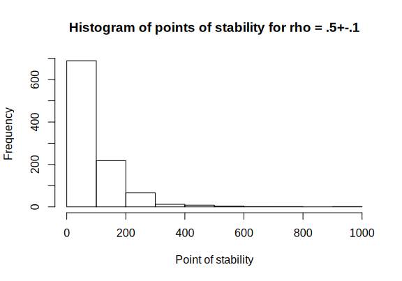

<!-- README.md is generated from README.Rmd. Please edit that file -->

# fastpos

<!-- badges: start -->

[](https://travis-ci.org/johannes-titz/fastpos)
[](https://codecov.io/gh/johannes-titz/fastpos?branch=master)
<!-- badges: end -->

This package provides a fast algorithm to calculate the required sample
size for a Pearson correlation to stabilize in the sequential framework
of Schönbrodt and Perugini (2013; 2018). I assume that you have read the
original paper or at least have an idea of how it works in principle.
Essentially you want to find the sample size at which you can be sure
that \(1-\alpha\) percent of many studies would fall into a specified
corridor of stability around an assumed population correlation and stay
inside the corridor if you add more participants to your study. For
instance, how many participants per study are required so that out of
100k studies, 90% would fall into the region between .4 to .6 (a Pearson
correlation) and not leave this region anymore when you add more
participants (under the assumption that the population correlation is
.5). This is also referred to as the critical point of stability.

## Installation

<!-- You can install the released version of fastpos from [CRAN](https://CRAN.R-project.org) with: -->

<!-- ``` r -->

<!-- install.packages("fastpos") -->

<!-- ``` -->

You can install the development version from
[GitHub](https://github.com/) with devtools (and vignettes build, this
takes a couple of seconds):

``` r
devtools::install_github("johannes-titz/fastpos", build_vignettes = TRUE)
```

## Using *fastpos*

If you have found this page, I assume you either want (1) to calculate
the critical point of stability for your own study or (2) to explore the
method in general. If this is the case, read on and hopefully you will
find what you are looking for. Let us first load the package and set a
seed for reproducibility:

``` r
library(fastpos)
set.seed(19950521)
```

In most cases you will just need the function **find\_critical\_pos**
which will you give you the critical point of stability for your
specific parameters.

Let us reproduce Schönbrodt and Peruigini’s quite famous, often cited
table of the critical points of stability for a precision of 0.1. We
reduce the number of studies to 10k so that it runs fairly quickly.

``` r
find_critical_pos(rho = seq(.1, .7, .1), sample_size_max = 1000,
                  n_studies = 10000)
#> Warning in find_critical_pos(rho = seq(0.1, 0.7, 0.1), sample_size_max = 1000, : 32 simulation[s] did not reach the corridor of
#>             stability.
#> Increase sample_size_max and rerun the simulation.
#>      rho_pop 80% 90%    95% sample_size_min sample_size_max lower_limit upper_limit n_studies n_not_breached precision
#> 1 0.09908227 253 359 476.00              20            1000         0.0         0.2     10000             11       0.1
#> 2 0.19993267 234 338 457.00              20            1000         0.1         0.3     10000             14       0.1
#> 3 0.29982634 212 300 396.05              20            1000         0.2         0.4     10000              5       0.1
#> 4 0.39933030 182 262 342.00              20            1000         0.3         0.5     10000              2       0.1
#> 5 0.50035764 139 204 270.00              20            1000         0.4         0.6     10000              0       0.1
#> 6 0.59961802 104 151 201.00              20            1000         0.5         0.7     10000              0       0.1
#> 7 0.69905041  65  96 128.05              20            1000         0.6         0.8     10000              0       0.1
#>   precision_rel
#> 1         FALSE
#> 2         FALSE
#> 3         FALSE
#> 4         FALSE
#> 5         FALSE
#> 6         FALSE
#> 7         FALSE
```

Note that a warning is shown because in some simulations the corridor of
stability was not reached. As long as this number is low, this should
not affect the estimates much. But if you want to get more accurate
estimates increase the maximum sample size.

You can obviously parallelize the process, which will be especially
useful if you want to run many simulations. For instance, if you
increase the number of studies to 100k (as in the original article), it
will take less than a minute on a modern CPU with several cores. On my
i7-2640 with 4 cores, it takes about 30 s. Overall, this is a speedup of
more than 1000 compared to Schönbrodt and Perugini’s code.

If you want to dig deeper, you can have a look at the functions that
*find\_critical\_pos* builds upon. **simulate\_pos** is the workhorse of
the package. It calls a C++ function to calculate correlations
sequentially and it does this pretty fast (but you know that already,
right?). A rawish approach would be to create a population with
**create\_pop** and pass it to **simulate\_pos**:

``` r
pop <- create_pop(0.5, 1000000)
pos <- simulate_pos(x_pop = pop[,1],
                    y_pop = pop[,2],
                    number_of_studies = 1000,
                    sample_size_min = 20,
                    sample_size_max = 1000,
                    replace = T,
                    lower_limit = 0.4,
                    upper_limit = 0.6)
hist(pos, xlim = c(0, 1000), xlab = c("Point of stability"),
     main = "Histogram of points of stability for rho = .5+-.1")
```



``` r
quantile(pos, c(.8, .9, .95))
#>    80%    90%    95% 
#> 138.00 196.10 263.05
```

Note that no warning message appears if the corridor is not reached. It
will simply return the maximum sample size. So pay careful attention if
you work with this function and adjust the maximum sample size as
needed.

**create\_pop** creates the population matrix by using **mvrnorm**. This
is a much simpler way compared to Schönbrodt and Perugini’s approach,
but the results do not seem to differ. If you are interested in how
population parameters (e.g. skewness) affect the point of stability, you
should rather refer to the population generating functions in Schönbrodt
and Perugini’s work.

## Issues and Support

If you find any bugs, please use the issue tracker at:

<https://github.com/johannes-titz/fastpos/issues>

If you need assistance in how to use the package, drop me an e-mail at
johannes at titz.science or johannes.titz at gmail.com

## Contributing

Contributions of any kind are very welcome\! I will sincerely consider
every suggestion on how to improve the code, the documentation and the
presented examples. Even minor things, such as suggestions for better
wording or improving grammar in any part of the package are considered
as valuable contributions.

If you want to make a pull request, please check that you can still
build the package without any errors, warnings or notes. Overall, simply
stick to the R packages book: <https://r-pkgs.org/> and follow the code
style described here: <http://r-pkgs.had.co.nz/r.html#style>

## References

Schönbrodt, F. D. & Perugini, M. (2013). At what sample size do
correlations stabilize? *Journal of Research in Personality, 47*,
609-612. \[<https://doi.org/10.1016/j.jrp.2013.05.009>\]

Schönbrodt, F. D. & Perugini, M. (2018) Corrigendum to “At what sample
size do correlations stabilize?” \[J. Res. Pers. 47 (2013) 609–612.
<https://doi.org/10.1016/j.jrp.2013.05.009>\]. *Journal of Research in
Personality, 74*, 194. \[<https://doi.org/10.1016/j.jrp.2018.02.010>\]
